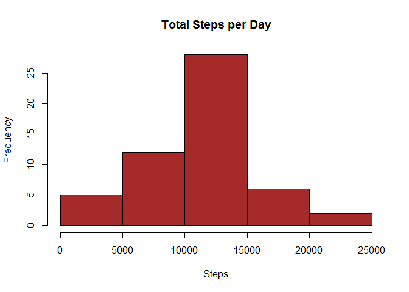
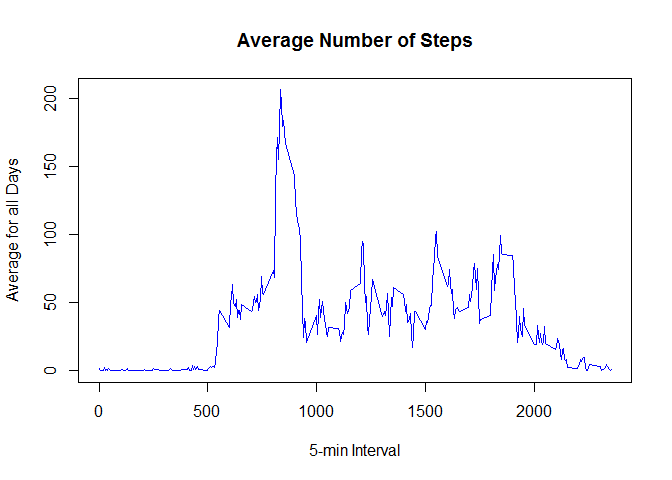
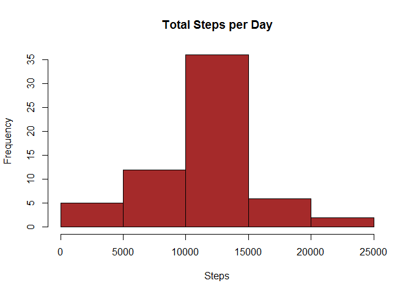
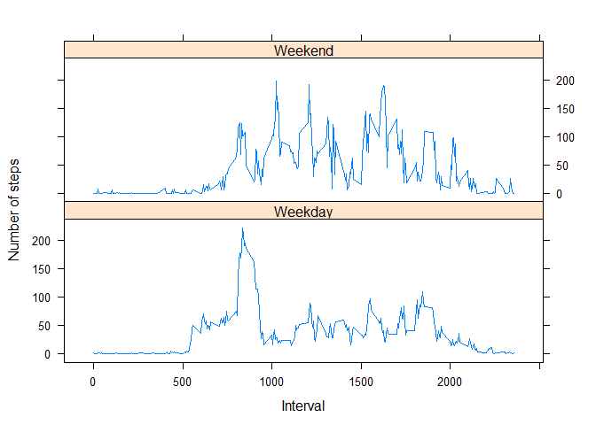

# Reproducible Research: Peer Assessment 1
Ivan Diaz  
Thursday, March 12, 2015  


## Loading and preprocessing the data

Reading the data & transforming column date type to date


```r
library(lattice)

activityDS <- read.csv("activity.csv", colClasses = c("numeric", "character", "numeric"))

head(activityDS)
```

```
##   steps       date interval
## 1    NA 2012-10-01        0
## 2    NA 2012-10-01        5
## 3    NA 2012-10-01       10
## 4    NA 2012-10-01       15
## 5    NA 2012-10-01       20
## 6    NA 2012-10-01       25
```

```r
activityDS$date <- as.Date(activityDS$date, "%Y-%m-%d")
```


## What is mean total number of steps taken per day?

Generating an agregate


```r
TotalSteps <- aggregate(steps ~ date, data = activityDS, sum, na.rm = TRUE)
```

Creating the histogram


```r
hist(TotalSteps$steps, main = "Total Steps per Day", xlab = "Steps", col = "brown")
```

 

The mean total number of steps taken per day is:


```r
mean(TotalSteps$steps)
```

```
## [1] 10766.19
```

The median total number of steps taken per day is:


```r
median(TotalSteps$steps)
```

```
## [1] 10765
```


## What is the average daily activity pattern?

Generating a time series for the mean of steps


```r
TimeSeries <- tapply(activityDS$steps, activityDS$interval, mean, na.rm = TRUE)

plot(row.names(TimeSeries), TimeSeries, type = "l", xlab = "5-min Interval", 
    ylab = "Average for all Days", main = "Average Number of Steps", 
    col = "blue")
```

 

Which 5-minute interval, on average across all the days in the dataset, contains the maximum number of steps?


```r
MaxInterval <- which.max(TimeSeries)
names(MaxInterval)
```

```
## [1] "835"
```

## Imputing missing values

Finding the total number of NA in activity data set


```r
summary(activityDS)
```

```
##      steps             date               interval     
##  Min.   :  0.00   Min.   :2012-10-01   Min.   :   0.0  
##  1st Qu.:  0.00   1st Qu.:2012-10-16   1st Qu.: 588.8  
##  Median :  0.00   Median :2012-10-31   Median :1177.5  
##  Mean   : 37.38   Mean   :2012-10-31   Mean   :1177.5  
##  3rd Qu.: 12.00   3rd Qu.:2012-11-15   3rd Qu.:1766.2  
##  Max.   :806.00   Max.   :2012-11-30   Max.   :2355.0  
##  NA's   :2304
```

Filling the missing values


```r
library(Hmisc)
```

```
## Warning: package 'Hmisc' was built under R version 3.1.3
```

```
## Loading required package: grid
## Loading required package: survival
## Loading required package: splines
## Loading required package: Formula
```

```
## Warning: package 'Formula' was built under R version 3.1.3
```

```
## Loading required package: ggplot2
## 
## Attaching package: 'Hmisc'
## 
## The following objects are masked from 'package:base':
## 
##     format.pval, round.POSIXt, trunc.POSIXt, units
```

```r
activity.imputed <- activityDS
activity.imputed$steps <- with(activity.imputed, impute(steps, mean))
```

Comparing mean and median with previous set


```r
TotalSteps.imputed <- tapply(activity.imputed$steps, 
                              activity.imputed$date, sum)
mean(TotalSteps$steps)
```

```
## [1] 10766.19
```

```r
mean(TotalSteps.imputed)
```

```
## [1] 10766.19
```

```r
median(TotalSteps$steps)
```

```
## [1] 10765
```

```r
median(TotalSteps.imputed)
```

```
## [1] 10766.19
```

Do these values differ from the estimates from the first part of the assignment? 
*A little*

What is the impact of imputing missing data on the estimates of the total daily number of steps?
*Not much really*

Creating the histogram


```r
hist(TotalSteps.imputed, main = "Total Steps per Day", xlab = "Steps", col = "brown")
```

 

## Are there differences in activity patterns between weekdays and weekends?

Making the factor & plotting the time series


```r
day <- weekdays(activityDS$date)
daylevel <- vector()
for (i in 1:nrow(activityDS)) {
    if (day[i] == "sabado") {
        daylevel[i] <- "Weekend"
    } else if (day[i] == "domingo") {
        daylevel[i] <- "Weekend"
    } else {
        daylevel[i] <- "Weekday"
    }
}

activityDS$daylevel <- daylevel
activityDS$daylevel <- factor(activityDS$daylevel)


stepsByDay <- aggregate(steps ~ interval + daylevel, data = activityDS, mean)
names(stepsByDay) <- c("interval", "daylevel", "steps")

xyplot(steps ~ interval | daylevel, stepsByDay, type = "l", layout = c(1, 2), 
    xlab = "Interval", ylab = "Number of steps")
```

 


